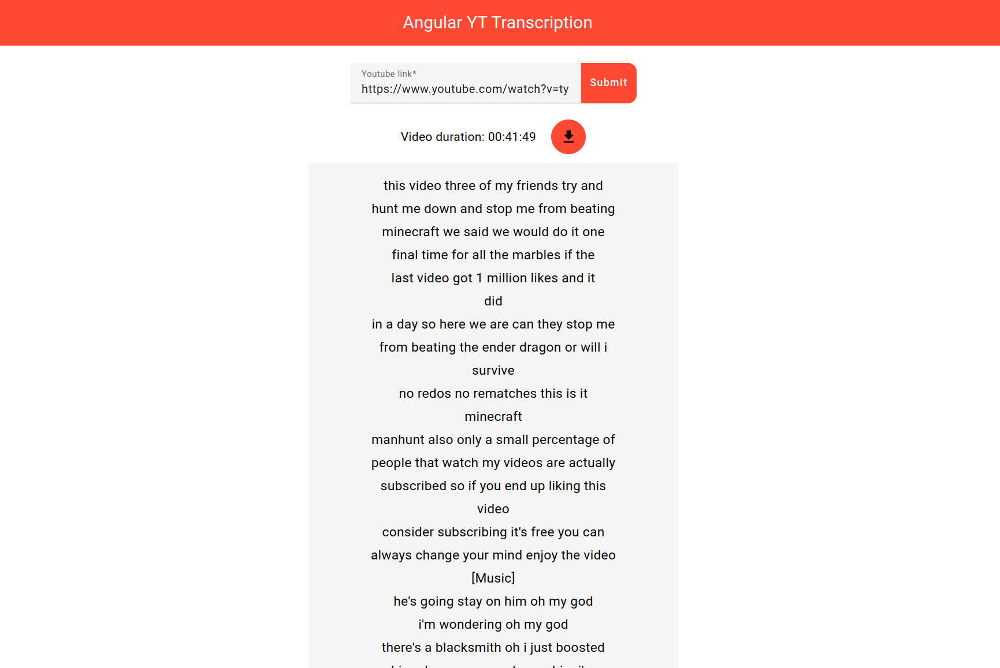

# Angular YT Transcription


Angular YT Transcription is designed to display a visual transcription of any YouTube video. It allows users to view the video's transcript in a visual format that makes it easier to read and follow along.



Try it out [here](https://pacna.github.io/angular-yt-transcription/) (**_note_**: you will probably need to install an [extension](https://chrome.google.com/webstore/detail/allow-cors-access-control/lhobafahddgcelffkeicbaginigeejlf/related?hl=en) to bypass any CORS related issues)

## Prerequisites

1. [Node.js](https://nodejs.org/en/)
2. [Docker](https://docs.docker.com/install/) (optional)
3. [Docker Compose](https://docs.docker.com/compose/install/) (optional)

## Installation

```bash
# install node modules
$ npm ci
```

## How to run locally

```bash
# run
$ ng serve
```

## How to run in production

```bash
# build
$ npm run build:ssr

# run
$ npm run serve:ssr
```

## How to run tests

```bash
# run
$ npm run test
```

## How to run in docker (Optional)

```bash
$ docker-compose up --build
```
